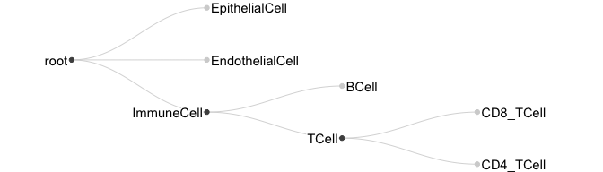

<!-- README.md is generated from README.Rmd. Please edit that file -->

# treelabel

<!-- badges: start -->
<!-- badges: end -->

The goal of treelabel is to store and work with labels that exist in a
hierarchical relationship.

This is an alpha software release: feel free to play around with the
code, and please provide feedback, but expect breaking changes to the
API!

## Motivation


I work on single-cell RNA-seq data with gene expression profiles for
thousands of cells. A common first step is to annotate each cell’s *cell
type*. The granularity of these cell type annotations can vary; one can
classify cells broadly into *immune cells* or *epithelial cells* or one
can be very detailed and distinguish within the immune cells *CD4
positive T regulatory cells* from *CD4 positive T follicular helper
cells*. Choosing the best annotation level is difficult because one
analysis may need broad cell types, whereas others require the highest
possible resolution. The `treelabel` package provides an intuitive
interface to store and work with these hierarchically related labels.

Depending on the reference data and annotation method used for the cell
typing, you often have multiple (partially) conflicting annotations.
`treelabel` provides functions to build a consensus across different
annotations and can integrate annotations at different resolutions.
Furthermore, `treelabel` supports uncertainty scores associated with a
label. For example, most automatic cell type scoring tools (like
[Azimuth](https://azimuth.hubmapconsortium.org/) or
[celltypist](https://www.celltypist.org/)), return a confidence score in
addition to the cell type label. These scores enable a more precise
selection of cells where you have sufficient confidence in the cell type
label.

## What this package is. And what it is not,

This package is purposefully kept generic and only makes the following
assumptions:

- Your labels have a tree-like relationship: the edges between the
  labels are directed, and there are no cycles.
- The relation between a parent and a child can phrased as *is a*. For
  example, a *`T cell` is a `Immune cell`*.
- The scores can be logical or non-negative numbers.

This package does not provide any functionality to:

- Assign cell types to cells based on the expression profile. Use any of
  the many available automatic cell type scoring tools (see for
  [this](https://github.com/seandavi/awesome-single-cell?tab=readme-ov-file#cell-type-identification-and-classification)
  list for some suggestions) or do it manually using clustering plus
  marker gene expression.
- Automatically harmonize cell type labels from different references
  (e.g., figure out that the `NK cells` from one dataset correspond to
  the `Natural killer cells` from another). You have to do this
  manually. There is an example further down in the README.
- Provide the optimal cell type tree. You will probably want to define
  the tree for your analysis depending on the annotations available to
  you. As a reference, look at the [cell ontology
  project](https://cell-ontology.github.io/), which provides a large
  database of cell type label relationships and is used by the Human
  Cell Atlas.
- Plot trees. For demonstration purposes, we will use the `igraph` plots
  (which are not very pretty), and for the plot on the top, I used the
  [D3](https://d3js.org/) library from Javascript (which is cumbersome
  to use from R). See the end of the README for an example how to make
  pretty plots of trees with ggplot2.

## Installation

You can install the development version of `treelabel` like this:

``` r
devtools::install_github("const-ae/treelabel")
```

# Documentation

`treelabel` is build to be directly compatible with the `tidyverse`.

``` r
library(treelabel)
library(tidyverse)
```

## Motivating example

I will demonstrate a typical single cell analysis workflow that takes a
hierarchical set of labels, stores them in a `treelabel` vector, and
analyzes the abundance changes of cell types.

I will illustrate the process using the “pbmcsca” dataset from Seurat
and score each cell using Azimuth. Note that `treelabel` is compatible
with any data storage format (e.g., `SingleCellExperiment` or `Seurat`)
and can handle both manual cell type labels based on clustering or
automated cell scores produced by, for example, Azimuth or Celltypist.

``` r
# This can take a minute to run through
library(Seurat)
# Might need to call `SeuratData::InstallData("pbmcsca")` first
pbmcsca <- SeuratData::LoadData("pbmcsca")
azimuth_res <- Azimuth::RunAzimuth(pbmcsca, reference = "pbmcref")
# Select most important columns to make the output easier to read.
azimuth_res@meta.data <- select(azimuth_res@meta.data, c("orig.ident", "Experiment", "Method", starts_with("predicted.celltype.")))
```

Take a look at the Azimuth output. It contains six new columns that all
start with “predicted.celltype”. These columns contain the labels and
confidence scores from the automated mapping. These will serve as the
input to `treelabel` which turns the six columns into one!

``` r
azimuth_res@meta.data |>
  as_tibble(rownames = "cell_id") 
#> # A tibble: 31,021 × 10
#>   cell_id            orig.ident Experiment Method     predicted.celltype.l1.…¹ predicted.celltype.l1
#>   <chr>              <fct>      <chr>      <chr>                         <dbl> <chr>                
#> 1 pbmc1_SM2_Cell_108 pbmc1      pbmc1      Smart-seq2                    0.966 NK                   
#> 2 pbmc1_SM2_Cell_115 pbmc1      pbmc1      Smart-seq2                    1     NK                   
#> 3 pbmc1_SM2_Cell_133 pbmc1      pbmc1      Smart-seq2                    0.988 NK                   
#> 4 pbmc1_SM2_Cell_142 pbmc1      pbmc1      Smart-seq2                    1     CD8 T                
#> 5 pbmc1_SM2_Cell_143 pbmc1      pbmc1      Smart-seq2                    0.763 NK                   
#> # ℹ 31,016 more rows
#> # ℹ abbreviated name: ¹​predicted.celltype.l1.score
#> # ℹ 4 more variables: predicted.celltype.l2.score <dbl>, predicted.celltype.l2 <chr>,
#> #   predicted.celltype.l3.score <dbl>, predicted.celltype.l3 <chr>
```

To create the `treelabel` vector, we need to define our cell type
hierarchy. We use the `igraph` packages for this.

``` r
# Define the cell type label hierarchy
pbmcsca_tree <- igraph::graph_from_literal(
  root - NK : `T cell` : Mono : DC : B,
  `T cell` - `CD8 T` : `CD4 T`,
  `CD4 T` - CTL : `CD4 Naive` : `CD4 TCM` : `CD4 TEM` : Treg,
  `CD8 T` - `CD8 Naive` : `CD8 TCM` : `CD8 TEM`,
  DC - cDC1 : cDC2 : pDC,
  Mono - `CD14 Mono` : `CD16 Mono`
)

# Convert the Azimuth result into a treelabel vector: 
# * We first append '.label' to the Azimuth column to make the `pivot_longer` simpler.
# * We then filter the cell types to the ones we list in the `pbmcsca_tree`.
# * Lastly, we convert the label and score column into a treelabel vector.
celltype_annotations <- azimuth_res@meta.data |>
  as_tibble(rownames = "cell_id") |>
  dplyr::rename_with(.cols = matches("^predicted.celltype.l\\d$"), \(x) paste0(x, ".label")) |>
  pivot_longer(starts_with("predicted.celltype"), names_prefix = "predicted\\.celltype\\.", names_sep = "\\." ,names_to = c("level", ".value")) |>
  filter(label %in% igraph::V(pbmcsca_tree)$name) |>
  treelabel_from_dataframe(pbmcsca_tree, id = "cell_id", label = "label", score = "score", name = "azimuth_celltypes")
```

The `azimuth_celltypes` column is an S3 vector (build ontop of the
`vctrs` package) which works a bit like a `factor`. Each entry contains
the full information about the hierarchical cell type labels. By
default, `treelabel` prints the most precise cell type label that is
available, but the information about the other levels is still
accessible

``` r
vec <- head(celltype_annotations$azimuth_celltypes, n = 8)
vec
#> <treelabel[8]>
#> [1] NK(0.97)      NK(1.00)      NK(0.99)      CD8 TEM(0.98) NK(0.76)      CD8 TEM(0.94)
#> [7] CD8 TEM(0.90) CD8 TEM(0.97)
#> # Tree: root, T cell, Mono, DC, CD8 T, CD4 T....

# The fourth element is a T cell, a CD8 T, and a CD8 TEM!
vec[4]
#> <treelabel[1]>
#> [1] CD8 TEM(0.98)
#> # Tree: root, T cell, Mono, DC, CD8 T, CD4 T....
tl_eval(vec[4], `T cell`)
#> [1] 1
tl_eval(vec[4], `CD8 T`)
#> [1] 1
tl_eval(vec[4], `CD8 TEM`)
#> [1] 0.9808054
```

We can join the `celltype_annotations` with the full meta data to
replace the old `predicted.celltype` column with our new `treelabel`.

``` r
meta_data <- azimuth_res@meta.data |>
  as_tibble(rownames = "cell_id") |>
  dplyr::select(- starts_with("predicted.celltype")) |>
  left_join(celltype_annotations, by = "cell_id")

meta_data
#> # A tibble: 31,021 × 5
#>   cell_id            orig.ident Experiment Method     azimuth_celltypes
#>   <chr>              <fct>      <chr>      <chr>                   <tl>
#> 1 pbmc1_SM2_Cell_108 pbmc1      pbmc1      Smart-seq2          NK(0.97)
#> 2 pbmc1_SM2_Cell_115 pbmc1      pbmc1      Smart-seq2          NK(1.00)
#> 3 pbmc1_SM2_Cell_133 pbmc1      pbmc1      Smart-seq2          NK(0.99)
#> 4 pbmc1_SM2_Cell_142 pbmc1      pbmc1      Smart-seq2     CD8 TEM(0.98)
#> 5 pbmc1_SM2_Cell_143 pbmc1      pbmc1      Smart-seq2          NK(0.76)
#> # ℹ 31,016 more rows
```

The `pbmcsca` contains results from ten different sequencing
experiments. We can for example count how often each cell type was seen
per method

``` r
# Summing the confidence scores does not exactly give you the counts
meta_data |>
  summarize(as_tibble(tl_score_matrix(sum(azimuth_celltypes, na.rm=TRUE))), .by = c(Method)) 
#> # A tibble: 9 × 22
#>   Method   root `T cell`  Mono    DC    NK     B `CD8 T` `CD4 T` `CD14 Mono` `CD16 Mono`  cDC1  cDC2
#>   <chr>   <dbl>    <dbl> <dbl> <dbl> <dbl> <dbl>   <dbl>   <dbl>       <dbl>       <dbl> <dbl> <dbl>
#> 1 Smart-…  421.     187.  72.1 10     74.8  77      115.    71.9        53.0        16.5 0.992  5   
#> 2 CEL-Se…  371.     188.  31.8  3.99  67.5  80.0    111.    77.4        11.7        17.4 0      3.73
#> 3 10x Ch… 2524.    1314. 715.  69.0  150.  276.     842.   472.        589.        108.  3.87  37.7 
#> 4 10x Ch… 2537.    1509. 407.  40.7  200.  379.     913.   596.        321.         77.9 0.976 28.7 
#> 5 10x Ch… 2568.    1538. 438.  33    213.  346.     971.   567.        329.        101.  0.995 21   
#> # ℹ 4 more rows
#> # ℹ 9 more variables: pDC <dbl>, `CD8 Naive` <dbl>, `CD8 TCM` <dbl>, `CD8 TEM` <dbl>, CTL <dbl>,
#> #   `CD4 Naive` <dbl>, `CD4 TCM` <dbl>, `CD4 TEM` <dbl>, Treg <dbl>

# Instead, you can say that only labels where the score exceeds a thresholds count.
meta_data |>
  mutate(azimuth_celltypes = tl_modify(azimuth_celltypes, .scores > 0.8)) |>
  summarize(as_tibble(tl_score_matrix(sum(azimuth_celltypes, na.rm=TRUE))), .by = c(Method))
#> # A tibble: 9 × 22
#>   Method   root `T cell`  Mono    DC    NK     B `CD8 T` `CD4 T` `CD14 Mono` `CD16 Mono`  cDC1  cDC2
#>   <chr>   <dbl>    <dbl> <dbl> <dbl> <dbl> <dbl>   <dbl>   <dbl>       <dbl>       <dbl> <dbl> <dbl>
#> 1 Smart-…   397      169    72    10    69    77     100      69          50          15     1     5
#> 2 CEL-Se…   302      134    23     4    61    80      72      62           3          15     0     4
#> 3 10x Ch…  2079      916   702    64   122   274     599     307         562          98     4    33
#> 4 10x Ch…  2129     1154   393    39   165   376     712     429         300          73     1    27
#> 5 10x Ch…  2381     1376   427    33   198   346     885     488         313         100     1    21
#> # ℹ 4 more rows
#> # ℹ 9 more variables: pDC <dbl>, `CD8 Naive` <dbl>, `CD8 TCM` <dbl>, `CD8 TEM` <dbl>, CTL <dbl>,
#> #   `CD4 Naive` <dbl>, `CD4 TCM` <dbl>, `CD4 TEM` <dbl>, Treg <dbl>
```

The `test_abundance_changes` function makes it easy to test if the
number of cells of a cell type changes between conditions. Importantly,
you need to have multiple independent replicates. The `pbmcsca`
unfortunately does not have that, so I will just simulate random patient
IDs to demonstrate how the function works.

``` r
# Apply threshold and make Experiment a factor
input_dat <- meta_data |>
  mutate(Experiment = as.factor(Experiment)) |>
  mutate(patient_id = sample(paste0("sample_", 1:5), size = n(), replace = TRUE)) |>
  mutate(azimuth_celltypes = tl_modify(azimuth_celltypes, .scores > 0.8)) 

# The function takes many arguments. See `?test_abundance_changes` for all details
test_abundance_changes(input_dat, design = ~ Experiment, aggregate_by = patient_id) 
#> Default contrast is: `cond(Experiment = 'pbmc2') - cond(Experiment = 'pbmc1')`
#> # A tibble: 20 × 7
#>   treelabel         target    LFC LFC_se dispersion          pval     adj_pval
#>   <chr>             <chr>   <dbl>  <dbl>      <dbl>         <dbl>        <dbl>
#> 1 azimuth_celltypes T cell -0.285 0.0226       1    0.00000148    0.00000651  
#> 2 azimuth_celltypes Mono   -0.424 0.0343       1.10 0.00000171    0.00000651  
#> 3 azimuth_celltypes DC      0.291 0.157        2.65 0.101         0.127       
#> 4 azimuth_celltypes NK      0.356 0.0518       1    0.000128      0.000305    
#> 5 azimuth_celltypes B       0.797 0.0324       1.05 0.00000000789 0.0000000500
#> # ℹ 15 more rows

# We can also run `test_abundance_changes` inside dplyr::reframe (an alternative to `summarize`)
# and calculate the abundance changes for each Method separately.
# Setting `reference = `T cell` will test if the number of T cell subtypes changes as a proportion
# of all T cells.
input_dat |>
  reframe(test_abundance_changes(data = across(everything()), design = ~ Experiment, aggregate_by = patient_id, 
                                 reference = `T cell`, contrast = cond(Experiment = 'pbmc2') - cond(Experiment = 'pbmc1')),
          .by = Method) 
#> # A tibble: 90 × 8
#>   Method     treelabel         target       LFC LFC_se dispersion   pval adj_pval
#>   <chr>      <chr>             <chr>      <dbl>  <dbl>      <dbl>  <dbl>    <dbl>
#> 1 Smart-seq2 azimuth_celltypes CD8 T     -0.658  0.234          1 0.0229   0.0343
#> 2 Smart-seq2 azimuth_celltypes CD4 T      0.817  0.244          1 0.0101   0.0238
#> 3 Smart-seq2 azimuth_celltypes CD8 Naive -0.421  0.837          1 0.628    0.628 
#> 4 Smart-seq2 azimuth_celltypes CD8 TCM    1.19   1.22           1 0.360    0.432 
#> 5 Smart-seq2 azimuth_celltypes CD8 TEM   -0.922  0.279          1 0.0107   0.0238
#> # ℹ 85 more rows
```

### Compatibility with Bioconductor and Seurat

`treelabel` works directly with the BioConductor data structures
`SingleCellExperiment`, `SummarizedExperiment`, and `DataFrame`.

``` r
# Load an example SingleCellExperiment object
suppressMessages({
  sce <- ExperimentHub::ExperimentHub()[["EH2259"]]
})
#> Warning: package 'SingleCellExperiment' was built under R version 4.4.2
# Make a simple tree with only one level
kang_tree <- igraph::graph_from_edgelist(cbind("root", levels(sce$cell)))
# Add treelabel column to colData
colData(sce)$treelabel <- treelabel(sce$cell, kang_tree)
colData(sce)
#> DataFrame with 29065 rows and 6 columns
#>                        ind     stim   cluster            cell multiplets       treelabel
#>                  <integer> <factor> <integer>        <factor>   <factor>     <treelabel>
#> AAACATACAATGCC-1       107     ctrl         5 CD4 T cells        doublet     CD4 T cells
#> AAACATACATTTCC-1      1016     ctrl         9 CD14+ Monocytes    singlet CD14+ Monocytes
#> AAACATACCAGAAA-1      1256     ctrl         9 CD14+ Monocytes    singlet CD14+ Monocytes
#> AAACATACCAGCTA-1      1256     ctrl         9 CD14+ Monocytes    doublet CD14+ Monocytes
#> AAACATACCATGCA-1      1488     ctrl         3 CD4 T cells        singlet     CD4 T cells
#> ...                    ...      ...       ...             ...        ...             ...
#> TTTGCATGCTAAGC-1       107     stim         6     CD4 T cells    singlet     CD4 T cells
#> TTTGCATGGGACGA-1      1488     stim         6     CD4 T cells    singlet     CD4 T cells
#> TTTGCATGGTGAGG-1      1488     stim         6     CD4 T cells    ambs        CD4 T cells
#> TTTGCATGGTTTGG-1      1244     stim         6     CD4 T cells    ambs        CD4 T cells
#> TTTGCATGTCTTAC-1      1016     stim         5     CD4 T cells    singlet     CD4 T cells
```

The `treelabel` vectors can also be used with Seurat data. Here, we
match the provided annotations to the names from the `pbmcsca_tree`.

``` r
# Load pbmcsca again
library(Seurat)
pbmcsca <- SeuratData::LoadData("pbmcsca")
```

``` r
# We will re-use the `pbmcsca_tree` from above. The provided annotations in pbmcsca$CellType
# are in a slightly different format, so we manually convert them.
rename_pbmcsca_celltypes <- c(
  "B cell" = "B", "CD14+ monocyte" = "CD14 Mono", "CD16+ monocyte" = "CD16 Mono",
  "CD4+ T cell" = "CD4 T", "Cytotoxic T cell" = "CD8 T",  "Dendritic cell" = "DC",
  "Megakaryocyte" = "Mono", "Natural killer cell" = "NK", 
  "Plasmacytoid dendritic cell" = "pDC", "Unassigned" = "root"
)

pbmcsca@meta.data$tl_manual <- treelabel(rename_pbmcsca_celltypes[pbmcsca$CellType], pbmcsca_tree)
pbmcsca@meta.data[1:5,c("orig.ident", "CellType", "tl_manual")]
#>                    orig.ident         CellType tl_manual
#> pbmc1_SM2_Cell_108      pbmc1 Cytotoxic T cell     CD8 T
#> pbmc1_SM2_Cell_115      pbmc1 Cytotoxic T cell     CD8 T
#> pbmc1_SM2_Cell_133      pbmc1 Cytotoxic T cell     CD8 T
#> pbmc1_SM2_Cell_142      pbmc1 Cytotoxic T cell     CD8 T
#> pbmc1_SM2_Cell_143      pbmc1 Cytotoxic T cell     CD8 T
```

## Technical documentation

We define our label hierarchy using
[`igraph`](https://r.igraph.org/articles/igraph.html).

``` r
tree <- igraph::graph_from_literal(
  root - ImmuneCell : EndothelialCell : EpithelialCell,
  ImmuneCell - TCell : BCell,
  TCell - CD4_TCell : CD8_TCell
)
plot(tree, layout = igraph::layout_as_tree(tree, root = "root"),
     vertex.size = 40, vertex.label.cex = 0.6)
```


### Constructors

The easiest way to make a `treelabel` vector is to make one from a
character vector. You call the `treelabel` constructor and provide the
labels and the reference tree

``` r
char_vec <- c("BCell", "EndothelialCell", "CD4_TCell", NA, "BCell", "EpithelialCell", "ImmuneCell")
vec <- treelabel(char_vec, tree = tree)
vec
#> <treelabel[7]>
#> [1] BCell           EndothelialCell CD4_TCell       <NA>            BCell           EpithelialCell 
#> [7] ImmuneCell     
#> # Tree: root, ImmuneCell, TCell, Endothelial....
```

If you have some uncertainty associated with each label, you can also
use a named `numeric` vector to make a `treelabel` vector.

``` r
num_vec <- c("BCell" = 0.99, "EndothelialCell" = 0.6, "CD4_TCell" = 0.8, NA, "BCell" = 0.78, "EpithelialCell" = 0.9, "ImmuneCell" = 0.4)
vec <- treelabel(num_vec, tree = tree)
vec
#> <treelabel[7]>
#> [1] BCell(0.99)           EndothelialCell(0.60) CD4_TCell(0.80)       <NA>                 
#> [5] BCell(0.78)           EpithelialCell(0.90)  ImmuneCell(0.40)     
#> # Tree: root, ImmuneCell, TCell, Endothelial....
```

Some tools provide the confidence scores for each vertex in the tree. In
this case, you can provide the annotations as a `list` or a `data.frame`

``` r
lst <- list(
  c(BCell = 0.99, ImmuneCell = 1),
  c(root = 1, EndothelialCell = 0.65),
  c(CD4_TCell = 0.8, TCell = 0.95, ImmuneCell = 0.95),
  NULL, # will be treated as NA
  c(ImmuneCell = 0.4)
)

vec <- treelabel(lst, tree)
vec
#> <treelabel[5]>
#> [1] BCell(0.99)           EndothelialCell(0.65) CD4_TCell(0.80)       <NA>                 
#> [5] ImmuneCell(0.40)     
#> # Tree: root, ImmuneCell, TCell, Endothelial....
```

Lastly, you can convert a “tidy” data frame to a treelabel. The
`treelabel_from_dataframe` works differently from the other
constructors, as it returns a `data.frame` with an ID column and a
`treelabel` column. The function cannot directly return a `treelabel`
vector because the order of the rows in the data.frame could be
scrambled, in which case it is unclear how cells and elements in the
treelabel relate.

``` r
df <- data.frame(
  cell_id = c("cell 1", "cell 1", "cell 2", "cell 3", "cell 3", "cell 3"),
  annot = c("BCell", "ImmuneCell", NA, "TCell", "CD4_TCell", "ImmuneCell"),
  confidence = c(0.99, 1, NA, 0.95, 0.8, 0.95)
)
df <- treelabel_from_dataframe(df, tree, id = "cell_id", label = "annot", score = "confidence")
df
#>   cell_id       treelabel
#> 1  cell 1     BCell(0.99)
#> 2  cell 2            <NA>
#> 3  cell 3 CD4_TCell(0.80)
```

### Working with the `treelabel` vector

The `treelabel` vectors can be indexed or concatenated like any regular
R vector:

``` r
vec
#> <treelabel[5]>
#> [1] BCell(0.99)           EndothelialCell(0.65) CD4_TCell(0.80)       <NA>                 
#> [5] ImmuneCell(0.40)     
#> # Tree: root, ImmuneCell, TCell, Endothelial....
length(vec)
#> [1] 5
vec[2]
#> <treelabel[1]>
#> [1] EndothelialCell(0.65)
#> # Tree: root, ImmuneCell, TCell, Endothelial....
vec[1:4]
#> <treelabel[4]>
#> [1] BCell(0.99)           EndothelialCell(0.65) CD4_TCell(0.80)       <NA>                 
#> # Tree: root, ImmuneCell, TCell, Endothelial....
c(vec, vec[1:3])
#> <treelabel[8]>
#> [1] BCell(0.99)           EndothelialCell(0.65) CD4_TCell(0.80)       <NA>                 
#> [5] ImmuneCell(0.40)      BCell(0.99)           EndothelialCell(0.65) CD4_TCell(0.80)      
#> # Tree: root, ImmuneCell, TCell, Endothelial....
```

You can extract the tree from a `treelabel` and the name of the tree
root.

``` r
tl_tree(vec)
#> IGRAPH f49c1c0 DN-- 8 7 -- 
#> + attr: name (v/c)
#> + edges from f49c1c0 (vertex names):
#> [1] root      ->ImmuneCell      root      ->EndothelialCell root      ->EpithelialCell 
#> [4] ImmuneCell->TCell           ImmuneCell->BCell           TCell     ->CD4_TCell      
#> [7] TCell     ->CD8_TCell
tl_tree_root(vec)
#> [1] "root"
```

The easiest way to get the score for a particular label inside a
`treelabel` vector is to use `$`

``` r
vec$ImmuneCell
#> [1] 1.00   NA 0.95   NA 0.40
vec$CD4_TCell
#> [1]  NA  NA 0.8  NA  NA
```

### Testing the identity

The printing function builds on the `tl_name`, which returns the vertex
furthest from the root that is not `NA`. We can change this threshold.
For example, for the third cell the *CD4_TCell* label does not pass the
`0.9` threshold, but the *TCell* label does.

``` r
tibble(vec, tl_name(vec), tl_name(vec, threshold = 0.9))
#> # A tibble: 5 × 3
#>                     vec `tl_name(vec)`  `tl_name(vec, threshold = 0.9)`
#>                    <tl> <chr>           <chr>                          
#> 1           BCell(0.99) BCell           BCell                          
#> 2 EndothelialCell(0.65) EndothelialCell root                           
#> 3       CD4_TCell(0.80) CD4_TCell       TCell                          
#> 4                    NA <NA>            <NA>                           
#> 5      ImmuneCell(0.40) ImmuneCell      <NA>
```

You can also evaluate arbitrary expressions using `tl_eval`.

``` r
tibble(vec) |> mutate(is_tcell = tl_eval(vec, TCell > 0.9))
#> # A tibble: 5 × 2
#>                     vec is_tcell
#>                    <tl> <lgl>   
#> 1           BCell(0.99) FALSE   
#> 2 EndothelialCell(0.65) FALSE   
#> 3       CD4_TCell(0.80) TRUE    
#> 4                    NA NA      
#> 5      ImmuneCell(0.40) FALSE
```

`treelabel` is clever about evaluating these expressions. If, for
example, we ask if the cell might be a T cell (i.e., `TCell > 0.2`), the
second and fifth entries switch from `FALSE` to `NA`.

``` r
tibble(vec) |> mutate(maybe_tcell = tl_eval(vec, TCell > 0.2))
#> # A tibble: 5 × 2
#>                     vec maybe_tcell
#>                    <tl> <lgl>      
#> 1           BCell(0.99) FALSE      
#> 2 EndothelialCell(0.65) NA         
#> 3       CD4_TCell(0.80) TRUE       
#> 4                    NA NA         
#> 5      ImmuneCell(0.40) NA
```

To understand why, let’s look at how `treelabel` internally stores the
data. Internally, the scores are stored as a matrix with one column for
each label, and the scores that were not specified are stored as `NA`.

``` r
tl_score_matrix(vec)
#>      root ImmuneCell EndothelialCell EpithelialCell TCell BCell CD4_TCell CD8_TCell
#> [1,] 1.00       1.00              NA             NA    NA  0.99        NA        NA
#> [2,] 1.00         NA            0.65             NA    NA    NA        NA        NA
#> [3,] 0.95       0.95              NA             NA  0.95    NA       0.8        NA
#> [4,]   NA         NA              NA             NA    NA    NA        NA        NA
#> [5,] 0.40       0.40              NA             NA    NA    NA        NA        NA
```

For each missing element, we can give a lower and upper bound for the
value. For the fifth element the confidence that it is an `ImmuneCell`
is `tl_get(vec[5], "ImmuneCell")` = 0.4. This means that each child can
also be at most `0.4`.

The general formula is that the score for a vertex `v` that is `NA` can
be at most (in pseudocode):
`max(0, score(parent(v)) - sum(children(parent(v)), na.rm=TRUE))`.

``` r
# tl_atmost is clever
tl_atmost(vec) |> tl_score_matrix()
#>      root ImmuneCell EndothelialCell EpithelialCell TCell BCell CD4_TCell CD8_TCell
#> [1,] 1.00       1.00            0.00           0.00  0.01  0.99      0.01      0.01
#> [2,] 1.00       0.35            0.65           0.35  0.35  0.35      0.35      0.35
#> [3,] 0.95       0.95            0.00           0.00  0.95  0.00      0.80      0.15
#> [4,]   NA         NA              NA             NA    NA    NA        NA        NA
#> [5,] 0.40       0.40            0.00           0.00  0.40  0.40      0.40      0.40
# tl_atleast simply replaces `NA`'s with zeros
tl_atleast(vec) |> tl_score_matrix()
#>      root ImmuneCell EndothelialCell EpithelialCell TCell BCell CD4_TCell CD8_TCell
#> [1,] 1.00       1.00            0.00              0  0.00  0.99       0.0         0
#> [2,] 1.00       0.00            0.65              0  0.00  0.00       0.0         0
#> [3,] 0.95       0.95            0.00              0  0.95  0.00       0.8         0
#> [4,]   NA         NA              NA             NA    NA    NA        NA        NA
#> [5,] 0.40       0.40            0.00              0  0.00  0.00       0.0         0
```

The `tl_eval` function evaluates its arguments for `tl_atmost(x)` and
`tl_atleast(x)`. If the results agree, that value is returned; if not,
`tl_eval` returns `NA`. A word of caution: this function can give
surprising results if multiple label references occur in the expression.

``` r
t1 <- treelabel(list(c("TCell" = 0.8)), tree)
# Ideally both function calls would return `NA`
tl_eval(t1, CD4_TCell > CD8_TCell) 
#> [1] FALSE
tl_eval(t1, CD4_TCell < CD8_TCell) 
#> [1] FALSE
```

### Arithmetic

You can combine two vectors or summarize across elements. You can do
whatever calculations you want, and `treelabel` will try to make the
right thing happen. You can also do problematic things like produce
negative values. `treelabel` currently does not stop you, but this
breaks one of the assumptions of `treelabel`.

``` r
vec2 <- treelabel(c("BCell" = 0.8, "EpithelialCell" = 0.3, "TCell" = 0.9, "CD8_TCell" = 0.2, "TCell" = 0.8), tree)
tibble(vec, vec2) |>
  mutate(arithmetic_mean = (vec + vec2) / 2,
         geometric_mean = (vec * vec2)^(1/2),
         rounding = round(vec))
#> # A tibble: 5 × 5
#>                     vec                 vec2  arithmetic_mean   geometric_mean              rounding
#>                    <tl>                 <tl>             <tl>             <tl>                  <tl>
#> 1           BCell(0.99)          BCell(0.80)      BCell(0.90)      BCell(0.89)           BCell(1.00)
#> 2 EndothelialCell(0.65) EpithelialCell(0.30)       root(0.65)       root(0.55) EndothelialCell(1.00)
#> 3       CD4_TCell(0.80)          TCell(0.90)      TCell(0.93)      TCell(0.92)       CD4_TCell(1.00)
#> 4                    NA      CD8_TCell(0.20)               NA               NA                    NA
#> 5      ImmuneCell(0.40)          TCell(0.80) ImmuneCell(0.60) ImmuneCell(0.57)                    NA
```

### Modification

You can modify the elements of a `treelabel` vector. The easiest is way
is to use `if_else` (note `ifelse` does not work!!) and mix the content
of two vectors. Alternatively, you can set elements to `NA`.

``` r
high_quality_res <- c(TRUE, FALSE, FALSE, FALSE, TRUE)
# Combine two vectors or set one to 'NA'
if_else(high_quality_res, vec, vec2)
#> <treelabel[5]>
#> [1] BCell(0.99)          EpithelialCell(0.30) TCell(0.90)          CD8_TCell(0.20)     
#> [5] ImmuneCell(0.40)    
#> # Tree: root, ImmuneCell, TCell, Endothelial....
if_else(high_quality_res, vec, NA)
#> <treelabel[5]>
#> [1] BCell(0.99)      <NA>             <NA>             <NA>             ImmuneCell(0.40)
#> # Tree: root, ImmuneCell, TCell, Endothelial....
```

If you want to modify the content within a tree, that is change the
value of individual vertices, you can use the `tl_modify` function.

``` r
# The effect of tl_modify is best understood by considering the underlying score matrix
tl_score_matrix(vec)[,1:3]
#>      root ImmuneCell EndothelialCell
#> [1,] 1.00       1.00              NA
#> [2,] 1.00         NA            0.65
#> [3,] 0.95       0.95              NA
#> [4,]   NA         NA              NA
#> [5,] 0.40       0.40              NA
tl_score_matrix(tl_modify(vec, ImmuneCell = 0.3))[,1:3]
#>      root ImmuneCell EndothelialCell
#> [1,] 1.00        0.3              NA
#> [2,] 1.00        0.3            0.65
#> [3,] 0.95        0.3              NA
#> [4,]   NA         NA              NA
#> [5,] 0.40        0.3              NA
tl_score_matrix(tl_modify(vec, ImmuneCell = ImmuneCell / 3))[,1:3]
#>      root ImmuneCell EndothelialCell
#> [1,] 1.00  0.3333333              NA
#> [2,] 1.00         NA            0.65
#> [3,] 0.95  0.3166667              NA
#> [4,]   NA         NA              NA
#> [5,] 0.40  0.1333333              NA
tl_score_matrix(tl_modify(vec, ImmuneCell = root - ImmuneCell/3))[,1:3]
#>      root ImmuneCell EndothelialCell
#> [1,] 1.00  0.6666667              NA
#> [2,] 1.00         NA            0.65
#> [3,] 0.95  0.6333333              NA
#> [4,]   NA         NA              NA
#> [5,] 0.40  0.2666667              NA
tl_score_matrix(tl_modify(vec, ImmuneCell = NA, .propagate_NAs_down = TRUE))
#>      root ImmuneCell EndothelialCell EpithelialCell TCell BCell CD4_TCell CD8_TCell
#> [1,] 1.00         NA              NA             NA    NA    NA        NA        NA
#> [2,] 1.00         NA            0.65             NA    NA    NA        NA        NA
#> [3,] 0.95         NA              NA             NA    NA    NA        NA        NA
#> [4,]   NA         NA              NA             NA    NA    NA        NA        NA
#> [5,] 0.40         NA              NA             NA    NA    NA        NA        NA
tl_score_matrix(tl_modify(vec, ImmuneCell = NA, .propagate_NAs_down = FALSE))
#>      root ImmuneCell EndothelialCell EpithelialCell TCell BCell CD4_TCell CD8_TCell
#> [1,] 1.00         NA              NA             NA    NA  0.99        NA        NA
#> [2,] 1.00         NA            0.65             NA    NA    NA        NA        NA
#> [3,] 0.95         NA              NA             NA  0.95    NA       0.8        NA
#> [4,]   NA         NA              NA             NA    NA    NA        NA        NA
#> [5,] 0.40         NA              NA             NA    NA    NA        NA        NA
```

#### Tree modifications

Sometimes you don’t want to change the values within the tree, but
change the tree structure or only work on a selected branch. The
`tl_tree_modify` allows you to set a completely new tree structure and
only retain values for vertices that occurr in both the new and old
tree.

``` r
subtree <- igraph::graph_from_literal(
  root - CD4_TCell : CD8_TCell : EndothelialCell : EpithelialCell
)

tl_score_matrix(vec)
#>      root ImmuneCell EndothelialCell EpithelialCell TCell BCell CD4_TCell CD8_TCell
#> [1,] 1.00       1.00              NA             NA    NA  0.99        NA        NA
#> [2,] 1.00         NA            0.65             NA    NA    NA        NA        NA
#> [3,] 0.95       0.95              NA             NA  0.95    NA       0.8        NA
#> [4,]   NA         NA              NA             NA    NA    NA        NA        NA
#> [5,] 0.40       0.40              NA             NA    NA    NA        NA        NA
tl_tree_modify(vec, subtree) |> tl_score_matrix()
#>      root CD4_TCell CD8_TCell EndothelialCell EpithelialCell
#> [1,] 1.00        NA        NA              NA             NA
#> [2,] 1.00        NA        NA            0.65             NA
#> [3,] 0.95       0.8        NA              NA             NA
#> [4,]   NA        NA        NA              NA             NA
#> [5,] 0.40        NA        NA              NA             NA
```

Sometimes, you only want to work on a single branch of the tree. You can
do this using the `tl_tree_filter` and `tl_tree_cut` functions.

``` r
# Select all T cells
tl_tree_cut(vec, new_root = "TCell")
#> <treelabel[5]>
#> [1] <NA>            <NA>            CD4_TCell(0.80) <NA>            <NA>           
#> # Tree: TCell, CD4_TCell, CD8_TCell

# This does the same, but leaves the old root
tl_tree_filter(vec, \(names) grepl("TCell", names))
#> <treelabel[5]>
#> [1] root(1.00)      root(1.00)      CD4_TCell(0.80) <NA>            root(0.40)     
#> # Tree: root, TCell, CD4_TCell, CD8_TCell
```

### Consensus construction

`treelabel` provides functions to make it easy to apply expression
across `treelabel` columns. These functions are built on top of
[`dplyr::across`](https://dplyr.tidyverse.org/reference/across.html).
They take as the first argument a specification of columns (e.g.,
`where(is_treelabel)` or `starts_with("label_")`). The second argument
is evaluated internally with `tl_eval`.

``` r
dat <- tibble(cell_id = paste0("cell_", 1:5), vec, vec2)

dat |> mutate(is_immune = tl_across(where(is_treelabel), ImmuneCell > 0.7))
#> # A tibble: 5 × 4
#>   cell_id                   vec                 vec2 is_immune$vec $vec2
#>   <chr>                    <tl>                 <tl> <lgl>         <lgl>
#> 1 cell_1            BCell(0.99)          BCell(0.80) TRUE          TRUE 
#> 2 cell_2  EndothelialCell(0.65) EpithelialCell(0.30) FALSE         FALSE
#> 3 cell_3        CD4_TCell(0.80)          TCell(0.90) TRUE          TRUE 
#> 4 cell_4                     NA      CD8_TCell(0.20) NA            FALSE
#> 5 cell_5       ImmuneCell(0.40)          TCell(0.80) FALSE         TRUE
dat |> mutate(immune_counts = tl_sum_across(where(is_treelabel), ImmuneCell > 0.7))
#> # A tibble: 5 × 4
#>   cell_id                   vec                 vec2 immune_counts
#>   <chr>                    <tl>                 <tl>         <dbl>
#> 1 cell_1            BCell(0.99)          BCell(0.80)             2
#> 2 cell_2  EndothelialCell(0.65) EpithelialCell(0.30)             0
#> 3 cell_3        CD4_TCell(0.80)          TCell(0.90)             2
#> 4 cell_4                     NA      CD8_TCell(0.20)             0
#> 5 cell_5       ImmuneCell(0.40)          TCell(0.80)             1
dat |> mutate(mean_immune_score = tl_mean_across(where(is_treelabel), ImmuneCell))
#> # A tibble: 5 × 4
#>   cell_id                   vec                 vec2 mean_immune_score
#>   <chr>                    <tl>                 <tl>             <dbl>
#> 1 cell_1            BCell(0.99)          BCell(0.80)             0.9  
#> 2 cell_2  EndothelialCell(0.65) EpithelialCell(0.30)             0    
#> 3 cell_3        CD4_TCell(0.80)          TCell(0.90)             0.925
#> 4 cell_4                     NA      CD8_TCell(0.20)             0.2  
#> 5 cell_5       ImmuneCell(0.40)          TCell(0.80)             0.6
dat |> filter(tl_if_all(where(is_treelabel), ImmuneCell > 0.7))
#> # A tibble: 2 × 3
#>   cell_id             vec        vec2
#>   <chr>              <tl>        <tl>
#> 1 cell_1      BCell(0.99) BCell(0.80)
#> 2 cell_3  CD4_TCell(0.80) TCell(0.90)
```

In addition, we can also work on the whole matrix of values per tree
label and combine them.

``` r
dat |>  mutate(consensus = tl_mean_across(c(vec,vec2)))
#> # A tibble: 5 × 4
#>   cell_id                   vec                 vec2             consensus
#>   <chr>                    <tl>                 <tl>                  <tl>
#> 1 cell_1            BCell(0.99)          BCell(0.80)           BCell(0.90)
#> 2 cell_2  EndothelialCell(0.65) EpithelialCell(0.30) EndothelialCell(0.65)
#> 3 cell_3        CD4_TCell(0.80)          TCell(0.90)       CD4_TCell(0.80)
#> 4 cell_4                     NA      CD8_TCell(0.20)       CD8_TCell(0.20)
#> 5 cell_5       ImmuneCell(0.40)          TCell(0.80)           TCell(0.80)

dat |> 
  mutate(across(c(vec, vec2), \(x) tl_modify(x, .scores > 0.5))) |>
  mutate(consensus = tl_sum_across(c(vec,vec2)))
#> # A tibble: 5 × 4
#>   cell_id                   vec        vec2             consensus
#>   <chr>                    <tl>        <tl>                  <tl>
#> 1 cell_1            BCell(1.00) BCell(1.00)           BCell(2.00)
#> 2 cell_2  EndothelialCell(1.00)          NA EndothelialCell(1.00)
#> 3 cell_3        CD4_TCell(1.00) TCell(1.00)       CD4_TCell(1.00)
#> 4 cell_4                     NA          NA                    NA
#> 5 cell_5                     NA TCell(1.00)           TCell(1.00)
```

### Pretty plotting

The following visualization is inspired by the default tree
visualization in D3.

``` r
#' Calculate layout of tree using igraph and return results as two tibbles.
prepare_tree_for_plotting <- function(tree, tree_root = "root"){
  tree <- .make_tree(tree, root = tree_root)
  
  layout <- igraph::layout_as_tree(tree, root = tree_root)
  
  children <- lapply(igraph::V(tree), \(v){
    igraph::neighbors(tree, v, mode = "out")$name
  })
  
  vertices <- igraph::V(tree)$name
  nodes <- tibble(node = vertices,
         distance_to_root = max(layout[,2]) - layout[,2],
         position = layout[,1],
         is_leaf = vapply(children, \(x) length(x) == 0, FUN.VALUE = logical(1L)))
  
  edges <- edges <- tibble(node = vertices,
       child = unname(children)) |>
    unnest(child) |>
    left_join(nodes, by = c("node" = "node")) |>
    left_join(nodes, by = c("child" = "node"), suffix = c(".node", ".child"))

  list(nodes = nodes, edges = edges)
}
```

Make the plot. The [ggbezier](https://github.com/const-ae/ggbezier) is
not on CRAN yet.

``` r
pl_tree <- prepare_tree_for_plotting(tree)

ggplot(data = pl_tree$nodes, aes(x = distance_to_root, y = position)) +
  ggbezier::geom_bezier(data = pl_tree$edges |>  pivot_longer(c(ends_with(".node"), ends_with(".child")), names_sep = "\\.", names_to = c(".value", "side")),
                        aes(x = distance_to_root, y = position, x_handle1 = distance_to_root - 0.4, 
                            x_handle2 = distance_to_root + 0.4, y_handle1 = position, y_handle2 = position, group = paste0(node, "-", child)),
                        show_handles = FALSE, color = "lightgrey", linewidth = 0.3) +
  geom_point(aes(color = I(ifelse(is_leaf, "lightgrey", "#4e4e4e")))) +
  shadowtext::geom_shadowtext(aes(label = node, hjust = ifelse(is_leaf, 0, 1), x = distance_to_root + ifelse(is_leaf, 0.03, -0.03)), 
                              color = "black", bg.colour = "white") +
  scale_x_continuous(expand = expansion(add = c(0.5, 0.9))) +
  theme_void()
#> Warning in ggbezier::geom_bezier(data = pivot_longer(pl_tree$edges, c(ends_with(".node"), :
#> Ignoring unknown aesthetics: x_handle1, x_handle2, y_handle1, and y_handle2
```



## Session Info

``` r
sessionInfo()
#> R version 4.4.1 (2024-06-14)
#> Platform: aarch64-apple-darwin20
#> Running under: macOS Sonoma 14.6
#> 
#> Matrix products: default
#> BLAS:   /Library/Frameworks/R.framework/Versions/4.4-arm64/Resources/lib/libRblas.0.dylib 
#> LAPACK: /Library/Frameworks/R.framework/Versions/4.4-arm64/Resources/lib/libRlapack.dylib;  LAPACK version 3.12.0
#> 
#> locale:
#> [1] en_US.UTF-8/en_US.UTF-8/en_US.UTF-8/C/en_US.UTF-8/en_US.UTF-8
#> 
#> time zone: Europe/London
#> tzcode source: internal
#> 
#> attached base packages:
#> [1] stats4    stats     graphics  grDevices utils     datasets  methods   base     
#> 
#> other attached packages:
#>  [1] muscData_1.20.0             SingleCellExperiment_1.28.1 SummarizedExperiment_1.36.0
#>  [4] Biobase_2.66.0              GenomicRanges_1.58.0        GenomeInfoDb_1.42.0        
#>  [7] IRanges_2.40.0              S4Vectors_0.44.0            MatrixGenerics_1.18.0      
#> [10] matrixStats_1.4.1           ExperimentHub_2.14.0        AnnotationHub_3.14.0       
#> [13] BiocFileCache_2.14.0        dbplyr_2.5.0                BiocGenerics_0.52.0        
#> [16] shinyBS_0.61.1              Seurat_5.1.0                SeuratObject_5.0.2         
#> [19] sp_2.1-4                    lubridate_1.9.3             forcats_1.0.0              
#> [22] stringr_1.5.1               dplyr_1.1.4                 purrr_1.0.2                
#> [25] readr_2.1.5                 tidyr_1.3.1                 tibble_3.2.1               
#> [28] ggplot2_3.5.1               tidyverse_2.0.0             treelabel_0.0.7.2          
#> [31] testthat_3.2.1.1           
#> 
#> loaded via a namespace (and not attached):
#>   [1] fs_1.6.5                          ProtGenerics_1.38.0              
#>   [3] spatstat.sparse_3.1-0             bitops_1.0-9                     
#>   [5] DirichletMultinomial_1.48.0       TFBSTools_1.44.0                 
#>   [7] devtools_2.4.5                    httr_1.4.7                       
#>   [9] RColorBrewer_1.1-3                profvis_0.4.0                    
#>  [11] tools_4.4.1                       sctransform_0.4.1                
#>  [13] utf8_1.2.4                        R6_2.5.1                         
#>  [15] DT_0.33                           lazyeval_0.2.2                   
#>  [17] uwot_0.2.2                        rhdf5filters_1.18.0              
#>  [19] urlchecker_1.0.1                  withr_3.0.2                      
#>  [21] gridExtra_2.3                     progressr_0.15.1                 
#>  [23] cli_3.6.3                         spatstat.explore_3.3-3           
#>  [25] fastDummies_1.7.4                 EnsDb.Hsapiens.v86_2.99.0        
#>  [27] shinyjs_2.1.0                     labeling_0.4.3                   
#>  [29] spatstat.data_3.1-4               ggridges_0.5.6                   
#>  [31] pbapply_1.7-2                     Rsamtools_2.22.0                 
#>  [33] R.utils_2.12.3                    parallelly_1.39.0                
#>  [35] sessioninfo_1.2.2                 BSgenome_1.74.0                  
#>  [37] rstudioapi_0.17.1                 RSQLite_2.3.8                    
#>  [39] generics_0.1.3                    BiocIO_1.16.0                    
#>  [41] gtools_3.9.5                      ica_1.0-3                        
#>  [43] spatstat.random_3.3-2             googlesheets4_1.1.1              
#>  [45] ggbezier_0.1.0                    GO.db_3.20.0                     
#>  [47] Matrix_1.7-1                      fansi_1.0.6                      
#>  [49] abind_1.4-8                       R.methodsS3_1.8.2                
#>  [51] lifecycle_1.0.4                   yaml_2.3.10                      
#>  [53] rhdf5_2.50.0                      SparseArray_1.6.0                
#>  [55] Rtsne_0.17                        glmGamPoi_1.19.3                 
#>  [57] grid_4.4.1                        blob_1.2.4                       
#>  [59] promises_1.3.2                    shinydashboard_0.7.2             
#>  [61] pwalign_1.2.0                     crayon_1.5.3                     
#>  [63] miniUI_0.1.1.1                    lattice_0.22-6                   
#>  [65] beachmat_2.22.0                   cowplot_1.1.3                    
#>  [67] annotate_1.84.0                   GenomicFeatures_1.58.0           
#>  [69] KEGGREST_1.46.0                   pillar_1.9.0                     
#>  [71] knitr_1.49                        rjson_0.2.23                     
#>  [73] future.apply_1.11.3               codetools_0.2-20                 
#>  [75] fastmatch_1.1-4                   leiden_0.4.3.1                   
#>  [77] glue_1.8.0                        spatstat.univar_3.1-1            
#>  [79] data.table_1.16.2                 remotes_2.5.0                    
#>  [81] vctrs_0.6.5                       png_0.1-8                        
#>  [83] spam_2.11-0                       cellranger_1.1.0                 
#>  [85] poweRlaw_0.80.0                   gtable_0.3.6                     
#>  [87] cachem_1.1.0                      xfun_0.50                        
#>  [89] Signac_1.14.0                     S4Arrays_1.6.0                   
#>  [91] mime_0.12                         pracma_2.4.4                     
#>  [93] survival_3.7-0                    gargle_1.5.2                     
#>  [95] pbmcref.SeuratData_1.0.0          RcppRoll_0.3.1                   
#>  [97] ellipsis_0.3.2                    fitdistrplus_1.2-1               
#>  [99] ROCR_1.0-11                       nlme_3.1-166                     
#> [101] usethis_3.1.0                     bit64_4.5.2                      
#> [103] filelock_1.0.3                    RcppAnnoy_0.0.22                 
#> [105] rprojroot_2.0.4                   irlba_2.3.5.1                    
#> [107] KernSmooth_2.23-24                seqLogo_1.72.0                   
#> [109] SeuratDisk_0.0.0.9021             colorspace_2.1-1                 
#> [111] DBI_1.2.3                         tidyselect_1.2.1                 
#> [113] bit_4.5.0                         compiler_4.4.1                   
#> [115] curl_6.2.1                        hdf5r_1.3.11                     
#> [117] desc_1.4.3                        DelayedArray_0.32.0              
#> [119] plotly_4.10.4                     shadowtext_0.1.4                 
#> [121] rtracklayer_1.66.0                caTools_1.18.3                   
#> [123] scales_1.3.0                      lmtest_0.9-40                    
#> [125] rappdirs_0.3.3                    digest_0.6.37                    
#> [127] goftest_1.2-3                     presto_1.0.0                     
#> [129] spatstat.utils_3.1-1              rmarkdown_2.29                   
#> [131] XVector_0.46.0                    htmltools_0.5.8.1                
#> [133] pkgconfig_2.0.3                   fastmap_1.2.0                    
#> [135] ensembldb_2.30.0                  rlang_1.1.4                      
#> [137] htmlwidgets_1.6.4                 UCSC.utils_1.2.0                 
#> [139] shiny_1.10.0                      farver_2.1.2                     
#> [141] zoo_1.8-12                        jsonlite_1.8.9                   
#> [143] BiocParallel_1.40.0               R.oo_1.27.0                      
#> [145] RCurl_1.98-1.16                   magrittr_2.0.3                   
#> [147] GenomeInfoDbData_1.2.13           dotCall64_1.2                    
#> [149] patchwork_1.3.0                   pbmcsca.SeuratData_3.0.0         
#> [151] Rhdf5lib_1.28.0                   munsell_0.5.1                    
#> [153] Rcpp_1.0.13-1                     reticulate_1.40.0                
#> [155] stringi_1.8.4                     brio_1.1.5                       
#> [157] zlibbioc_1.52.0                   MASS_7.3-61                      
#> [159] plyr_1.8.9                        pkgbuild_1.4.5                   
#> [161] parallel_4.4.1                    listenv_0.9.1                    
#> [163] ggrepel_0.9.6                     CNEr_1.42.0                      
#> [165] deldir_2.0-4                      Biostrings_2.74.0                
#> [167] splines_4.4.1                     tensor_1.5                       
#> [169] hms_1.1.3                         BSgenome.Hsapiens.UCSC.hg38_1.4.5
#> [171] igraph_2.1.1                      spatstat.geom_3.3-4              
#> [173] RcppHNSW_0.6.0                    reshape2_1.4.4                   
#> [175] pkgload_1.4.0                     TFMPvalue_0.0.9                  
#> [177] BiocVersion_3.20.0                XML_3.99-0.17                    
#> [179] evaluate_1.0.1                    BiocManager_1.30.25              
#> [181] JASPAR2020_0.99.10                tzdb_0.4.0                       
#> [183] httpuv_1.6.15                     RANN_2.6.2                       
#> [185] polyclip_1.10-7                   future_1.34.0                    
#> [187] SeuratData_0.2.2.9001             scattermore_1.2                  
#> [189] xtable_1.8-4                      restfulr_0.0.15                  
#> [191] AnnotationFilter_1.30.0           RSpectra_0.16-2                  
#> [193] later_1.4.0                       googledrive_2.1.1                
#> [195] viridisLite_0.4.2                 lungref.SeuratData_2.0.0         
#> [197] Azimuth_0.5.0                     memoise_2.0.1                    
#> [199] AnnotationDbi_1.68.0              GenomicAlignments_1.42.0         
#> [201] cluster_2.1.6                     timechange_0.3.0                 
#> [203] globals_0.16.3
```
