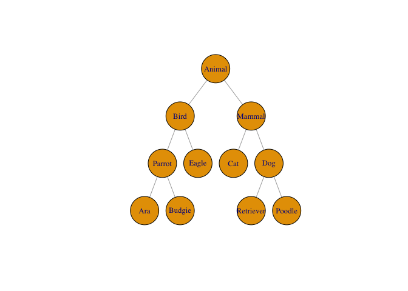
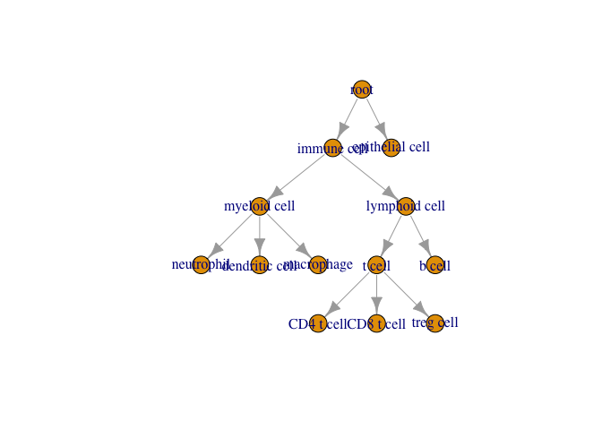

<!-- README.md is generated from README.Rmd. Please edit that file -->

# treelabel

<!-- badges: start -->
<!-- badges: end -->

The goal of treelabel is to allow storing labels which exist in a
hierarchical relationship.

## Installation

You can install the development version of treelabel like so:

``` r
devtools::install_github("const-ae/treelabel")
```

## Example

We begin by defining our label hierarchy using
[`igraph`](https://r.igraph.org/articles/igraph.html).

``` r
tree <- igraph::graph_from_literal(
  Animal - Bird : Mammal,
  Mammal - Cat : Dog,
  Dog - Retriever : Poodle,
  Bird - Parrot : Eagle,
  Parrot - Ara  : Budgie
)
plot(tree, layout = igraph::layout_as_tree(tree, root = "Animal"),
     vertex.size = 40, vertex.label.cex = 0.8)
```



If you provide a character vector and a tree defining the hierarchy, you
get a `treelabel` vector that is backed by a matrix of `TRUE` / `FALSE`
values indicating the logical relationships.

``` r
library(treelabel)
vec <- treelabel(c("Ara", "Eagle", "Cat", NA, "Ara", "Poodle", "Cat", "Cat"), tree = tree, tree_root = "Animal")
vec
#> <treelabel[8]>
#> [1] Ara    Eagle  Cat    <NA>   Ara    Poodle Cat    Cat   
#> # Tree: Animal, Bird, Mammal, Parrot, Dog, E....
```

The underlying matrix:

``` r
tl_score_matrix(vec)
#>      Animal  Bird Mammal Parrot   Dog Eagle   Cat   Ara Budgie Retriever Poodle
#> [1,]   TRUE  TRUE  FALSE   TRUE FALSE FALSE FALSE  TRUE  FALSE     FALSE  FALSE
#> [2,]   TRUE  TRUE  FALSE  FALSE FALSE  TRUE FALSE FALSE  FALSE     FALSE  FALSE
#> [3,]   TRUE FALSE   TRUE  FALSE FALSE FALSE  TRUE FALSE  FALSE     FALSE  FALSE
#> [4,]     NA    NA     NA     NA    NA    NA    NA    NA     NA        NA     NA
#> [5,]   TRUE  TRUE  FALSE   TRUE FALSE FALSE FALSE  TRUE  FALSE     FALSE  FALSE
#> [6,]   TRUE FALSE   TRUE  FALSE  TRUE FALSE FALSE FALSE  FALSE     FALSE   TRUE
#> [7,]   TRUE FALSE   TRUE  FALSE FALSE FALSE  TRUE FALSE  FALSE     FALSE  FALSE
#> [8,]   TRUE FALSE   TRUE  FALSE FALSE FALSE  TRUE FALSE  FALSE     FALSE  FALSE
```

You can test if an element is of a specific type with the `tl_get`
function.

``` r
# Is the element an eagle?
tl_get(vec, "Eagle")
#> [1] FALSE  TRUE FALSE    NA FALSE FALSE FALSE FALSE

# Is the element a bird?
tl_get(vec, "Bird")
#> [1]  TRUE  TRUE FALSE    NA  TRUE FALSE FALSE FALSE
```

You can also express uncertainty about any particular label

``` r
vec2 <- treelabel(list(
  c(Dog = 1, Poodle = 0.8, Retriever = 0.2),
  c(Cat = 0.9),
  c(Animal = 0.78)
), tree, tree_root = "Animal")

treelabel(tree = tree, tree_root = "Animal")
#> <treelabel[0]>
#> # Tree: Animal, Bird, Mammal, Parrot, Dog, E....

vec2
#> <treelabel[3]>
#> [1] Poodle(0.80) Cat(0.90)    Animal(0.78)
#> # Tree: Animal, Bird, Mammal, Parrot, Dog, E....
```

Concatenation

``` r
c(tl_as_numeric(vec), vec2)
#> <treelabel[11]>
#>  [1] Ara(1.00)    Eagle(1.00)  Cat(1.00)    <NA>         Ara(1.00)   
#>  [6] Poodle(1.00) Cat(1.00)    Cat(1.00)    Poodle(0.80) Cat(0.90)   
#> [11] Animal(0.78)
#> # Tree: Animal, Bird, Mammal, Parrot, Dog, E....

# c("Eagle", vec)
c(vec, "Eagle")
#> <treelabel[9]>
#> [1] Ara    Eagle  Cat    <NA>   Ara    Poodle Cat    Cat    Eagle 
#> # Tree: Animal, Bird, Mammal, Parrot, Dog, E....
```

``` r
library(tidyverse)
#> ── Attaching core tidyverse packages ──────────────────────── tidyverse 2.0.0 ──
#> ✔ dplyr     1.1.4     ✔ readr     2.1.5
#> ✔ forcats   1.0.0     ✔ stringr   1.5.1
#> ✔ ggplot2   3.5.1     ✔ tibble    3.2.1
#> ✔ lubridate 1.9.3     ✔ tidyr     1.3.1
#> ✔ purrr     1.0.2     
#> ── Conflicts ────────────────────────────────────────── tidyverse_conflicts() ──
#> ✖ dplyr::filter() masks stats::filter()
#> ✖ dplyr::lag()    masks stats::lag()
#> ℹ Use the conflicted package (<http://conflicted.r-lib.org/>) to force all conflicts to become errors
tibble(id = seq_len(8), vec) |>
  filter(tl_eval(vec, Bird))
#> # A tibble: 3 × 2
#>      id   vec
#>   <int>  <tl>
#> 1     1   Ara
#> 2     2 Eagle
#> 3     5   Ara
```

# Cell type scores

``` r
edges <- c("root", "immune cell",
           "root", "epithelial cell",
           "immune cell", "myeloid cell",
           "immune cell", "lymphoid cell",
           "lymphoid cell", "t cell",
           "lymphoid cell", "b cell",
           "t cell", "CD4 t cell",
           "t cell", "CD8 t cell",
           "t cell", "treg cell",
           "myeloid cell", "neutrophil",
           "myeloid cell", "dendritic cell",
           "myeloid cell", "macrophage")

g <- igraph::graph(edges, directed = TRUE)
#> Warning: `graph()` was deprecated in igraph 2.1.0.
#> ℹ Please use `make_graph()` instead.
#> This warning is displayed once every 8 hours.
#> Call `lifecycle::last_lifecycle_warnings()` to see where this warning was
#> generated.
plot(g, layout = igraph::layout_as_tree(g, root = "root"))
```



``` r
label_list <- list(c("immune cell" = 1, "lymphoid cell" = 0.99, "b cell" = 0.7),
     c("immune cell" = 1, "lymphoid cell" = 0.99, "t cell" = 0.6, "b cell" = 0.3, "CD4 t cell" = 0.59),
     c("immune cell" = 1, "lymphoid cell" = 0.99, "t cell" = 0.6, "b cell" = 0.3, "CD4 t cell" = 0.59),
     c("immune cell" = 1, "lymphoid cell" = 0.99, "t cell" = 0.6, "b cell" = 0.2, "CD8 t cell" = 0.59),
     c("immune cell" = 1, "lymphoid cell" = 0.99, "t cell" = 0.89, "b cell" = 0.1, "CD4 t cell" = 0.89),
     c("myeloid cell" = 1),
     c("myeloid cell" = 1, "dendritic cell" = 1))
labels1 <- treelabel(label_list, tree = g)

labels1
#> <treelabel[7]>
#> [1] b cell(0.70)         CD4 t cell(0.59)     CD4 t cell(0.59)    
#> [4] CD8 t cell(0.59)     CD4 t cell(0.89)     myeloid cell(1.00)  
#> [7] dendritic cell(1.00)
#> # Tree: root, immune cell, epithelial cell, ....
```

Arithmetics

``` r
mean(labels1, na.rm=TRUE) |> tl_score_matrix()
#>      root immune cell epithelial cell myeloid cell lymphoid cell t cell b cell
#> [1,]    1           1             NaN            1          0.99 0.6725   0.32
#>      neutrophil dendritic cell macrophage CD4 t cell CD8 t cell treg cell
#> [1,]        NaN              1        NaN       0.69       0.59       NaN
```

``` r
df <- tibble(id = seq_along(labels1), label1 = labels1) 
df |>
  mutate(new_score = tl_eval(label1, log(`t cell` + 17)))
#> # A tibble: 7 × 3
#>      id               label1 new_score
#>   <int>                 <tl>     <dbl>
#> 1     1         b cell(0.70)     NA   
#> 2     2     CD4 t cell(0.59)      2.87
#> 3     3     CD4 t cell(0.59)      2.87
#> 4     4     CD8 t cell(0.59)      2.87
#> 5     5     CD4 t cell(0.89)      2.88
#> 6     6   myeloid cell(1.00)     NA   
#> 7     7 dendritic cell(1.00)     NA
```

``` r
labels1
#> <treelabel[7]>
#> [1] b cell(0.70)         CD4 t cell(0.59)     CD4 t cell(0.59)    
#> [4] CD8 t cell(0.59)     CD4 t cell(0.89)     myeloid cell(1.00)  
#> [7] dendritic cell(1.00)
#> # Tree: root, immune cell, epithelial cell, ....
tl_score_matrix(labels1)
#>      root immune cell epithelial cell myeloid cell lymphoid cell t cell b cell
#> [1,]    1           1              NA           NA          0.99     NA    0.7
#> [2,]    1           1              NA           NA          0.99   0.60    0.3
#> [3,]    1           1              NA           NA          0.99   0.60    0.3
#> [4,]    1           1              NA           NA          0.99   0.60    0.2
#> [5,]    1           1              NA           NA          0.99   0.89    0.1
#> [6,]    1           1              NA            1            NA     NA     NA
#> [7,]    1           1              NA            1            NA     NA     NA
#>      neutrophil dendritic cell macrophage CD4 t cell CD8 t cell treg cell
#> [1,]         NA             NA         NA         NA         NA        NA
#> [2,]         NA             NA         NA       0.59         NA        NA
#> [3,]         NA             NA         NA       0.59         NA        NA
#> [4,]         NA             NA         NA         NA       0.59        NA
#> [5,]         NA             NA         NA       0.89         NA        NA
#> [6,]         NA             NA         NA         NA         NA        NA
#> [7,]         NA              1         NA         NA         NA        NA
```

``` r
labels2 <- treelabel(c("b cell", "CD4 t cell", "CD4 t cell", "dendritic cell", "CD4 t cell", "dendritic cell", "dendritic cell"), g, "root")

df <- tibble(id = seq_along(labels1), 
             label1 = labels1, 
             label2 = labels2)
df
#> # A tibble: 7 × 3
#>      id               label1         label2
#>   <int>                 <tl>           <tl>
#> 1     1         b cell(0.70)         b cell
#> 2     2     CD4 t cell(0.59)     CD4 t cell
#> 3     3     CD4 t cell(0.59)     CD4 t cell
#> 4     4     CD8 t cell(0.59) dendritic cell
#> 5     5     CD4 t cell(0.89)     CD4 t cell
#> 6     6   myeloid cell(1.00) dendritic cell
#> 7     7 dendritic cell(1.00) dendritic cell
# sum(df$label2) |> tl_score_matrix()

df |>
  mutate(new = tl_mean_across(starts_with("label"), `CD4 t cell` > 0.8) )
#> # A tibble: 7 × 4
#>      id               label1         label2   new
#>   <int>                 <tl>           <tl> <dbl>
#> 1     1         b cell(0.70)         b cell   0  
#> 2     2     CD4 t cell(0.59)     CD4 t cell   0.5
#> 3     3     CD4 t cell(0.59)     CD4 t cell   0.5
#> 4     4     CD8 t cell(0.59) dendritic cell   0  
#> 5     5     CD4 t cell(0.89)     CD4 t cell   1  
#> 6     6   myeloid cell(1.00) dendritic cell   0  
#> 7     7 dendritic cell(1.00) dendritic cell   0

df |>
  filter(tl_if_all(starts_with("label"), `t cell` > 0.3))
#> # A tibble: 3 × 3
#>      id           label1     label2
#>   <int>             <tl>       <tl>
#> 1     2 CD4 t cell(0.59) CD4 t cell
#> 2     3 CD4 t cell(0.59) CD4 t cell
#> 3     5 CD4 t cell(0.89) CD4 t cell

df |>
  mutate(n_tcell = tl_sum_across(starts_with("label"), `t cell` > 0.3))
#> # A tibble: 7 × 4
#>      id               label1         label2 n_tcell
#>   <int>                 <tl>           <tl>   <dbl>
#> 1     1         b cell(0.70)         b cell       0
#> 2     2     CD4 t cell(0.59)     CD4 t cell       2
#> 3     3     CD4 t cell(0.59)     CD4 t cell       2
#> 4     4     CD8 t cell(0.59) dendritic cell       1
#> 5     5     CD4 t cell(0.89)     CD4 t cell       2
#> 6     6   myeloid cell(1.00) dendritic cell       0
#> 7     7 dendritic cell(1.00) dendritic cell       0
```

# Session Info

``` r
sessionInfo()
#> R version 4.4.1 (2024-06-14)
#> Platform: aarch64-apple-darwin20
#> Running under: macOS Sonoma 14.6
#> 
#> Matrix products: default
#> BLAS:   /Library/Frameworks/R.framework/Versions/4.4-arm64/Resources/lib/libRblas.0.dylib 
#> LAPACK: /Library/Frameworks/R.framework/Versions/4.4-arm64/Resources/lib/libRlapack.dylib;  LAPACK version 3.12.0
#> 
#> locale:
#> [1] en_US.UTF-8/en_US.UTF-8/en_US.UTF-8/C/en_US.UTF-8/en_US.UTF-8
#> 
#> time zone: Europe/London
#> tzcode source: internal
#> 
#> attached base packages:
#> [1] stats     graphics  grDevices utils     datasets  methods   base     
#> 
#> other attached packages:
#>  [1] lubridate_1.9.3 forcats_1.0.0   stringr_1.5.1   dplyr_1.1.4    
#>  [5] purrr_1.0.2     readr_2.1.5     tidyr_1.3.1     tibble_3.2.1   
#>  [9] ggplot2_3.5.1   tidyverse_2.0.0 treelabel_0.0.2
#> 
#> loaded via a namespace (and not attached):
#>  [1] gtable_0.3.6      crayon_1.5.3      compiler_4.4.1    tidyselect_1.2.1 
#>  [5] scales_1.3.0      yaml_2.3.10       fastmap_1.2.0     R6_2.5.1         
#>  [9] generics_0.1.3    igraph_2.1.1      knitr_1.49        munsell_0.5.1    
#> [13] pillar_1.9.0      tzdb_0.4.0        rlang_1.1.4       utf8_1.2.4       
#> [17] stringi_1.8.4     xfun_0.49         timechange_0.3.0  cli_3.6.3        
#> [21] withr_3.0.2       magrittr_2.0.3    digest_0.6.37     grid_4.4.1       
#> [25] rstudioapi_0.17.1 hms_1.1.3         lifecycle_1.0.4   vctrs_0.6.5      
#> [29] evaluate_1.0.1    glue_1.8.0        fansi_1.0.6       colorspace_2.1-1 
#> [33] rmarkdown_2.29    matrixStats_1.4.1 tools_4.4.1       pkgconfig_2.0.3  
#> [37] htmltools_0.5.8.1
```
