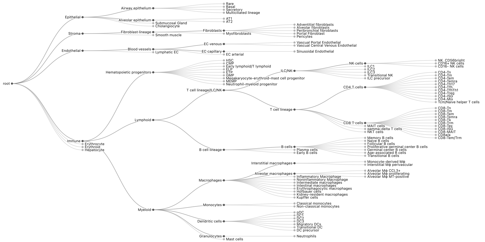
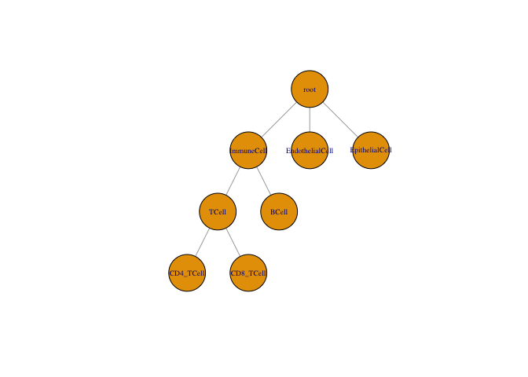

<!-- README.md is generated from README.Rmd. Please edit that file -->

# treelabel

<!-- badges: start -->
<!-- badges: end -->

The goal of treelabel is to store and work with labels that exist in a
hierarchical relationship.

This is an alpha software release: feel free to play around with the
code, and please provide feedback, but expect breaking changes to the
API!

## Motivation



I work on single-cell RNA-seq data with gene expression profiles for
thousands of cells. A common first step is to annotate each cell’s *cell
type*. The granularity of these cell type annotations can vary; one can
classify cells broadly into *immune cells* or *epithelial cells* or one
can be very detailed and distinguish within the immune cells *CD4
positive T regulatory cells* from *CD4 positive T follicular helper
cells*. Choosing the best annotation level can be difficult because one
analysis may need broad cell types, whereas others require the highest
possible resolution. The `treelabel` package provides an intuitive
interface to store and work with these hierarchically related labels.

Depending on the reference data and annotation method used for the cell
typing, you often have multiple (partially) conflicting annotations.
`treelabel` provides functions to build a consensus across different
annotations and can integrate annotations at different resolutions.
Furthermore, `treelabel` supports uncertainty scores associated with a
label. For example, most automatic cell type scoring tools (like
[Azimuth](https://azimuth.hubmapconsortium.org/) or
[celltypist](https://www.celltypist.org/)), return a confidence score in
addition to the cell type label. These scores enable a more precise
selection of cells where you have sufficient confidence in the cell type
label.

## What this package is. And what it is not,

This package is purposefully kept generic and only makes the following
assumptions:

- Your labels have a tree-like relationship: the edges between the
  labels are directed, and there are no cycles.
- The relation between a parent and a child can phrased as *is a*. For
  example, a *`T cell` is a `Immune cell`*.
- The scores can be logical or non-negative numbers.

This package does not provide any functionality to:

- Assign cell types to cells based on the expression profile. Use any of
  the many available automatic cell type scoring tools (see for
  [this](https://github.com/seandavi/awesome-single-cell?tab=readme-ov-file#cell-type-identification-and-classification)
  list for a selection) or do it manually using clustering plus marker
  gene expression.
- Automatically harmonize cell type labels from different references
  (e.g., figure out that the `NK cells` from one dataset correspond to
  the `Natural killer cells` from another). You will probably have to do
  this manually. There is an example further down in the README.
- Provide the optimal cell type tree. You will probably want to define
  the tree for your analysis depending on the annotations available to
  you. As a reference, look at the [cell ontology
  project](https://cell-ontology.github.io/), which provides a large
  database of cell type label relationships and is used by the Human
  Cell Atlas.
- Plot trees. For demonstration purposes, we will use the `igraph` plots
  (which are not very pretty), and for the plot on the top, I used the
  [D3](https://d3js.org/) library from Javascript (which is cumbersome
  to use from R). In the long term, I will probably want to develop
  additional tooling to improve this, but such code would probably live
  outside this package.

## Installation

You can install the development version of `treelabel` like this:

``` r
devtools::install_github("const-ae/treelabel")
```

## Example

We define our label hierarchy using
[`igraph`](https://r.igraph.org/articles/igraph.html).

``` r
tree <- igraph::graph_from_literal(
  root - ImmuneCell : EndothelialCell : EpithelialCell,
  ImmuneCell - TCell : BCell,
  TCell - CD4_TCell : CD8_TCell
)
plot(tree, layout = igraph::layout_as_tree(tree, root = "root"),
     vertex.size = 40, vertex.label.cex = 0.6)
```



``` r
library(treelabel)
# We will also load the tidyverse to demonstrate some functionality later
library(tidyverse)
```

### Constructors

The easiest way to make a `treelabel` vector is to make one from a
character vector. You call the `treelabel` constructor and provide the
labels and the reference tree

``` r
char_vec <- c("BCell", "EndothelialCell", "CD4_TCell", NA, "BCell", "EpithelialCell", "ImmuneCell")
vec <- treelabel(char_vec, tree = tree)
vec
#> <treelabel[7]>
#> [1] BCell           EndothelialCell CD4_TCell       <NA>            BCell           EpithelialCell 
#> [7] ImmuneCell     
#> # Tree: root, ImmuneCell, TCell, Endothelial....
```

If you have some uncertainty associated with each label, you can also
use a named `numeric` vector to make a `treelabel` vector.

``` r
num_vec <- c("BCell" = 0.99, "EndothelialCell" = 0.6, "CD4_TCell" = 0.8, NA, "BCell" = 0.78, "EpithelialCell" = 0.9, "ImmuneCell" = 0.4)
vec <- treelabel(num_vec, tree = tree)
vec
#> <treelabel[7]>
#> [1] BCell(0.99)           EndothelialCell(0.60) CD4_TCell(0.80)       <NA>                 
#> [5] BCell(0.78)           EpithelialCell(0.90)  ImmuneCell(0.40)     
#> # Tree: root, ImmuneCell, TCell, Endothelial....
```

Some tools provide the confidence scores for tree vertex. In this case,
you can provide the annotations as a `list` or a `data.frame`

``` r
lst <- list(
  c(BCell = 0.99, ImmuneCell = 1),
  c(root = 1, EndothelialCell = 0.65),
  c(CD4_TCell = 0.8, TCell = 0.95, ImmuneCell = 0.95),
  NULL, # will be treated as NA
  c(ImmuneCell = 0.4)
)

vec <- treelabel(lst, tree)
vec
#> <treelabel[5]>
#> [1] BCell(0.99)           EndothelialCell(0.65) CD4_TCell(0.80)       <NA>                 
#> [5] ImmuneCell(0.40)     
#> # Tree: root, ImmuneCell, TCell, Endothelial....
```

Lastly, you can convert a “tidy” data frame to a treelabel. The
`treelabel_from_dataframe` works differently from the other
constructors, as it returns a `data.frame` with an ID column and a
`treelabel` column. The function cannot directly return a `treelabel`
vector because the order of the rows in the data.frame could be
scrambled, in which case it is unclear how cells and elements in the
treelabel relate.

``` r
df <- data.frame(
  cell_id = c("cell 1", "cell 1", "cell 2", "cell 3", "cell 3", "cell 3"),
  annot = c("BCell", "ImmuneCell", NA, "TCell", "CD4_TCell", "ImmuneCell"),
  confidence = c(0.99, 1, NA, 0.95, 0.8, 0.95)
)
df <- treelabel_from_dataframe(df, tree, id = "cell_id", label = "annot", score = "confidence")
df
#>   cell_id       treelabel
#> 1  cell 1     BCell(0.99)
#> 2  cell 2            <NA>
#> 3  cell 3 CD4_TCell(0.80)
```

### Working with the `treelabel` vector

The `treelabel` vectors can be indexed or concatenated like any regular
R vector:

``` r
vec
#> <treelabel[5]>
#> [1] BCell(0.99)           EndothelialCell(0.65) CD4_TCell(0.80)       <NA>                 
#> [5] ImmuneCell(0.40)     
#> # Tree: root, ImmuneCell, TCell, Endothelial....
length(vec)
#> [1] 5
vec[2]
#> <treelabel[1]>
#> [1] EndothelialCell(0.65)
#> # Tree: root, ImmuneCell, TCell, Endothelial....
vec[1:4]
#> <treelabel[4]>
#> [1] BCell(0.99)           EndothelialCell(0.65) CD4_TCell(0.80)       <NA>                 
#> # Tree: root, ImmuneCell, TCell, Endothelial....
c(vec, vec[1:3])
#> <treelabel[8]>
#> [1] BCell(0.99)           EndothelialCell(0.65) CD4_TCell(0.80)       <NA>                 
#> [5] ImmuneCell(0.40)      BCell(0.99)           EndothelialCell(0.65) CD4_TCell(0.80)      
#> # Tree: root, ImmuneCell, TCell, Endothelial....
```

It also automatically coerces strings or named vectors when
concatenating.

``` r
# Actually, this is not working yet.
# c(vec, c(BCell = 1))
```

You can extract the tree from a `treelabel` and the name of the tree
root.

``` r
tl_tree(vec)
#> IGRAPH 67461d7 DN-- 8 7 -- 
#> + attr: name (v/c)
#> + edges from 67461d7 (vertex names):
#> [1] root      ->ImmuneCell      root      ->EndothelialCell root      ->EpithelialCell 
#> [4] ImmuneCell->TCell           ImmuneCell->BCell           TCell     ->CD4_TCell      
#> [7] TCell     ->CD8_TCell
tl_tree_root(vec)
#> [1] "root"
```

### Testing the identity

The printing function builds on the `tl_name`, which returns the first
non `NA` vertex with a score larger than `0`. We can change this
threshold. For example, for the third cell the *CD4_TCell* label does
not pass the `0.9` threshold, but the *TCell* label does.

``` r
tibble(vec, tl_name(vec), tl_name(vec, threshold = 0.9))
#> # A tibble: 5 × 3
#>                     vec `tl_name(vec)`  `tl_name(vec, threshold = 0.9)`
#>                    <tl> <chr>           <chr>                          
#> 1           BCell(0.99) BCell           BCell                          
#> 2 EndothelialCell(0.65) EndothelialCell root                           
#> 3       CD4_TCell(0.80) CD4_TCell       TCell                          
#> 4                    NA <NA>            <NA>                           
#> 5      ImmuneCell(0.40) ImmuneCell      <NA>
```

You can also evaluate arbitrary expressions using `tl_eval`.

``` r
tibble(vec) |> mutate(is_tcell = tl_eval(vec, TCell > 0.9))
#> # A tibble: 5 × 2
#>                     vec is_tcell
#>                    <tl> <lgl>   
#> 1           BCell(0.99) FALSE   
#> 2 EndothelialCell(0.65) FALSE   
#> 3       CD4_TCell(0.80) TRUE    
#> 4                    NA NA      
#> 5      ImmuneCell(0.40) FALSE
```

`treelabel` is clever about evaluating these expressions. If, for
example, we ask if the cell might be a T cell (i.e., `TCell > 0.2`), the
second and fifth entries switch from `FALSE` to `NA`.

``` r
tibble(vec) |> mutate(maybe_tcell = tl_eval(vec, TCell > 0.2))
#> # A tibble: 5 × 2
#>                     vec maybe_tcell
#>                    <tl> <lgl>      
#> 1           BCell(0.99) FALSE      
#> 2 EndothelialCell(0.65) NA         
#> 3       CD4_TCell(0.80) TRUE       
#> 4                    NA NA         
#> 5      ImmuneCell(0.40) NA
```

To understand why, let’s look at how `treelabel` internally stores the
data. Internally, the scores are stored as a matrix with one column for
each label, and the scores that were not specified are stored as `NA`.

``` r
tl_score_matrix(vec)
#>      root ImmuneCell EndothelialCell EpithelialCell TCell BCell CD4_TCell CD8_TCell
#> [1,] 1.00       1.00              NA             NA    NA  0.99        NA        NA
#> [2,] 1.00         NA            0.65             NA    NA    NA        NA        NA
#> [3,] 0.95       0.95              NA             NA  0.95    NA       0.8        NA
#> [4,]   NA         NA              NA             NA    NA    NA        NA        NA
#> [5,] 0.40       0.40              NA             NA    NA    NA        NA        NA
```

For each missing element, we can give a lower and upper bound for the
value. For the fifth element the confidence that it is an `ImmuneCell`
is `tl_get(vec[5], "ImmuneCell")` = 0.4. This means that each child can
also be at most `0.4`.

The general formula is that the score for a vertex `v` that is `NA` can
be at most (in pseudocode):
`max(0, score(parent(v)) - sum(children(parent(v)), na.rm=TRUE))`.

``` r
# tl_atmost is clever
tl_atmost(vec) |> tl_score_matrix()
#>      root ImmuneCell EndothelialCell EpithelialCell TCell BCell CD4_TCell CD8_TCell
#> [1,] 1.00       1.00            0.00           0.00  0.01  0.99      0.01      0.01
#> [2,] 1.00       0.35            0.65           0.35  0.35  0.35      0.35      0.35
#> [3,] 0.95       0.95            0.00           0.00  0.95  0.00      0.80      0.15
#> [4,]   NA         NA              NA             NA    NA    NA        NA        NA
#> [5,] 0.40       0.40            0.00           0.00  0.40  0.40      0.40      0.40
# tl_atleast simply replaces `NA`'s with zeros
tl_atleast(vec) |> tl_score_matrix()
#>      root ImmuneCell EndothelialCell EpithelialCell TCell BCell CD4_TCell CD8_TCell
#> [1,] 1.00       1.00            0.00              0  0.00  0.99       0.0         0
#> [2,] 1.00       0.00            0.65              0  0.00  0.00       0.0         0
#> [3,] 0.95       0.95            0.00              0  0.95  0.00       0.8         0
#> [4,]   NA         NA              NA             NA    NA    NA        NA        NA
#> [5,] 0.40       0.40            0.00              0  0.00  0.00       0.0         0
```

The `tl_eval` function evaluates its arguments for `tl_atmost(x)` and
`tl_atleast(x)`. If the results agree, it is returned; if not, `tl_eval`
returns `NA`. A word of caution: this function can give surprising
results if multiple label references occur in the expression.

``` r
t1 <- treelabel(list(c("TCell" = 0.8)), tree)
# Ideally both function calls would return `NA`
tl_eval(t1, CD4_TCell > CD8_TCell) 
#> [1] FALSE
tl_eval(t1, CD4_TCell < CD8_TCell) 
#> [1] FALSE
```

## Arithmetic

You can combine two vectors or summarize across elements. You can do
whatever calculations you want, and `treelabel` will try to make the
right thing happen. You can also do problematic things like produce
negative values. `treelabel` currently does not stop you, but this
breaks one of the assumptions of `treelabel`.

``` r
vec2 <- treelabel(c("BCell" = 0.8, "EpithelialCell" = 0.3, "TCell" = 0.9, "CD8_TCell" = 0.2, "TCell" = 0.8), tree)
tibble(vec, vec2) |>
  mutate(arithmetic_mean = (vec + vec2) / 2,
         geometric_mean = (vec * vec2)^(1/2),
         rounding = round(vec))
#> # A tibble: 5 × 5
#>                     vec                 vec2  arithmetic_mean   geometric_mean              rounding
#>                    <tl>                 <tl>             <tl>             <tl>                  <tl>
#> 1           BCell(0.99)          BCell(0.80)      BCell(0.90)      BCell(0.89)           BCell(1.00)
#> 2 EndothelialCell(0.65) EpithelialCell(0.30)       root(0.65)       root(0.55) EndothelialCell(1.00)
#> 3       CD4_TCell(0.80)          TCell(0.90)      TCell(0.93)      TCell(0.92)       CD4_TCell(1.00)
#> 4                    NA      CD8_TCell(0.20)               NA               NA                    NA
#> 5      ImmuneCell(0.40)          TCell(0.80) ImmuneCell(0.60) ImmuneCell(0.57)                    NA
```

## Consensus construction

`treelabel` provides functions to make it easy to apply expression
across `treelabel` columns. These functions are built on top of
[`tidyr::across`](https://dplyr.tidyverse.org/reference/across.html)
function. They take as the first argument a specification of columns
(e.g., `where(is_treelabel)` or `starts_with("label_")`). The second
argument is evaluated internally with `tl_eval`.

``` r
dat <- tibble(cell_id = paste0("cell_", 1:5), vec, vec2)

dat |> mutate(is_immune = tl_across(where(is_treelabel), ImmuneCell > 0.7))
#> # A tibble: 5 × 4
#>   cell_id                   vec                 vec2 is_immune$vec $vec2
#>   <chr>                    <tl>                 <tl> <lgl>         <lgl>
#> 1 cell_1            BCell(0.99)          BCell(0.80) TRUE          TRUE 
#> 2 cell_2  EndothelialCell(0.65) EpithelialCell(0.30) FALSE         FALSE
#> 3 cell_3        CD4_TCell(0.80)          TCell(0.90) TRUE          TRUE 
#> 4 cell_4                     NA      CD8_TCell(0.20) NA            FALSE
#> 5 cell_5       ImmuneCell(0.40)          TCell(0.80) FALSE         TRUE
dat |> mutate(immune_counts = tl_sum_across(where(is_treelabel), ImmuneCell > 0.7))
#> # A tibble: 5 × 4
#>   cell_id                   vec                 vec2 immune_counts
#>   <chr>                    <tl>                 <tl>         <dbl>
#> 1 cell_1            BCell(0.99)          BCell(0.80)             2
#> 2 cell_2  EndothelialCell(0.65) EpithelialCell(0.30)             0
#> 3 cell_3        CD4_TCell(0.80)          TCell(0.90)             2
#> 4 cell_4                     NA      CD8_TCell(0.20)             0
#> 5 cell_5       ImmuneCell(0.40)          TCell(0.80)             1
dat |> mutate(mean_immune_score = tl_mean_across(where(is_treelabel), ImmuneCell))
#> # A tibble: 5 × 4
#>   cell_id                   vec                 vec2 mean_immune_score
#>   <chr>                    <tl>                 <tl>             <dbl>
#> 1 cell_1            BCell(0.99)          BCell(0.80)             0.9  
#> 2 cell_2  EndothelialCell(0.65) EpithelialCell(0.30)             0    
#> 3 cell_3        CD4_TCell(0.80)          TCell(0.90)             0.925
#> 4 cell_4                     NA      CD8_TCell(0.20)             0.2  
#> 5 cell_5       ImmuneCell(0.40)          TCell(0.80)             0.6
dat |> filter(tl_if_all(where(is_treelabel), ImmuneCell > 0.7))
#> # A tibble: 2 × 3
#>   cell_id             vec        vec2
#>   <chr>              <tl>        <tl>
#> 1 cell_1      BCell(0.99) BCell(0.80)
#> 2 cell_3  CD4_TCell(0.80) TCell(0.90)
```

# Session Info

``` r
sessionInfo()
#> R version 4.4.1 (2024-06-14)
#> Platform: aarch64-apple-darwin20
#> Running under: macOS Sonoma 14.6
#> 
#> Matrix products: default
#> BLAS:   /Library/Frameworks/R.framework/Versions/4.4-arm64/Resources/lib/libRblas.0.dylib 
#> LAPACK: /Library/Frameworks/R.framework/Versions/4.4-arm64/Resources/lib/libRlapack.dylib;  LAPACK version 3.12.0
#> 
#> locale:
#> [1] en_US.UTF-8/en_US.UTF-8/en_US.UTF-8/C/en_US.UTF-8/en_US.UTF-8
#> 
#> time zone: Europe/London
#> tzcode source: internal
#> 
#> attached base packages:
#> [1] stats     graphics  grDevices utils     datasets  methods   base     
#> 
#> other attached packages:
#>  [1] lubridate_1.9.3  forcats_1.0.0    stringr_1.5.1    dplyr_1.1.4      purrr_1.0.2     
#>  [6] readr_2.1.5      tidyr_1.3.1      tibble_3.2.1     ggplot2_3.5.1    tidyverse_2.0.0 
#> [11] treelabel_0.0.3  testthat_3.2.1.1
#> 
#> loaded via a namespace (and not attached):
#>  [1] generics_0.1.3    utf8_1.2.4        stringi_1.8.4     hms_1.1.3         digest_0.6.37    
#>  [6] magrittr_2.0.3    timechange_0.3.0  evaluate_1.0.1    grid_4.4.1        pkgload_1.4.0    
#> [11] fastmap_1.2.0     rprojroot_2.0.4   pkgbuild_1.4.5    sessioninfo_1.2.2 brio_1.1.5       
#> [16] urlchecker_1.0.1  promises_1.3.1    fansi_1.0.6       scales_1.3.0      cli_3.6.3        
#> [21] shiny_1.9.1       rlang_1.1.4       munsell_0.5.1     ellipsis_0.3.2    remotes_2.5.0    
#> [26] withr_3.0.2       cachem_1.1.0      yaml_2.3.10       devtools_2.4.5    tools_4.4.1      
#> [31] tzdb_0.4.0        memoise_2.0.1     colorspace_2.1-1  httpuv_1.6.15     vctrs_0.6.5      
#> [36] R6_2.5.1          mime_0.12         matrixStats_1.4.1 lifecycle_1.0.4   fs_1.6.5         
#> [41] htmlwidgets_1.6.4 usethis_3.1.0     miniUI_0.1.1.1    pkgconfig_2.0.3   desc_1.4.3       
#> [46] pillar_1.9.0      later_1.4.0       gtable_0.3.6      glue_1.8.0        profvis_0.4.0    
#> [51] Rcpp_1.0.13-1     tidyselect_1.2.1  xfun_0.49         rstudioapi_0.17.1 knitr_1.49       
#> [56] xtable_1.8-4      htmltools_0.5.8.1 igraph_2.1.1      rmarkdown_2.29    compiler_4.4.1
```
